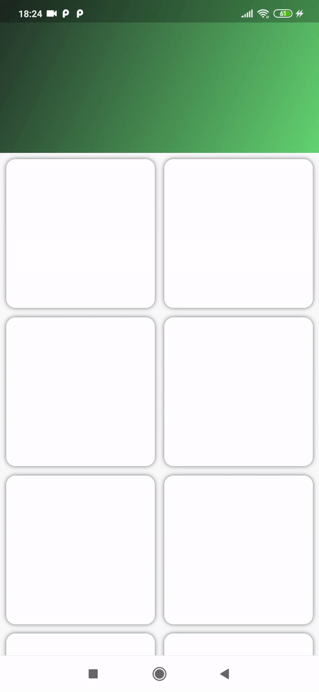
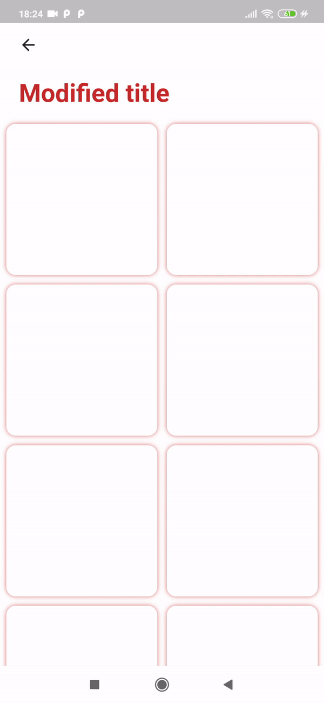
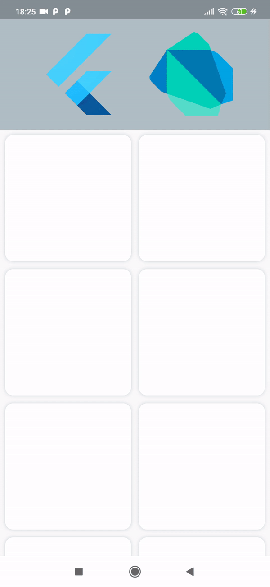

# sliver_header_delegate
This package provides a FlexibleHeaderDelegate.

## Getting Started

In the `pubspec.yaml` of your flutter project, add the following dependency:

```yaml
dependencies:
    ...
    flutter_advanced_switch: <latest_version>
```

Import in your project:

```dart
import 'package:sliver_header_delegate/sliver_header_delegate.dart';
```

Inside your `CustomScrollView` declare `SliverPersistentHeader` and set `FlexibleHeaderDelegate` as it's delegate

```dart
CustomScrollView(
      slivers: [
        SliverPersistentHeader(
          delegate: FlexibleHeaderDelegate(),
        ),
      ],
    );
```

If you want your widget to fill the status bar, specify `statusBarHeight` parameter:

```dart
delegate: FlexibleHeaderDelegate(
            statusBarHeight: MediaQuery.of(context).padding.top,
          ),
```


## Examples

# Mutable background


```dart
 SliverPersistentHeader(
            pinned: true,
            delegate: FlexibleHeaderDelegate(
              expandedHeight: 240,
              background: MutableBackground(
                expandedWidget: Image.network(_imageUrl, fit: BoxFit.cover),
                collapsedColor: _headerColor,
              ),
            ),
          ),
```


# Gradient background




```dart
  SliverPersistentHeader(
            pinned: true,
            delegate: FlexibleHeaderDelegate(
              background: GradientBackground(
                gradient: LinearGradient(
                  begin: Alignment.topLeft,
                  end: Alignment.bottomRight,
                  colors: [
                    _startColor,
                    _endColor,
                  ],
                ),
              ),
            ),
          ),
```


# Modified title




```dart
    SliverPersistentHeader(
              pinned: true,
              delegate: FlexibleHeaderDelegate(
                backgroundColor: Colors.white,
                children: [
                  FlexibleTextItem(
                    text: 'Modified title',
                    expandedStyle: _expandedTextStyle,
                    collapsedStyle: _collapsedTextStyle,
                    expandedAlignment: Alignment.bottomLeft,
                    collapsedAlignment: Alignment.center,
                    expandedPadding: _expandedPadding,
                  ),
                ],
              ),
            ),
```


# Customized items




```dart
     SliverPersistentHeader(
                pinned: true,
                delegate: FlexibleHeaderDelegate(
                    backgroundColor: _headerColor,
                    children: [
                      FlexibleHeaderItem(
                        child: _DartLogo(),
                        options: [HeaderItemOptions.hide],
                        alignment: Alignment.centerRight,
                        expandedPadding: _expandedPadding,
                      ),
                      FlexibleHeaderItem(
                        child: _FlutterLogo(),
                        options: [HeaderItemOptions.scale],
                        alignment: Alignment.centerLeft,
                        expandedPadding: _expandedPadding,
                      ),
                    ]),
              ),
```
